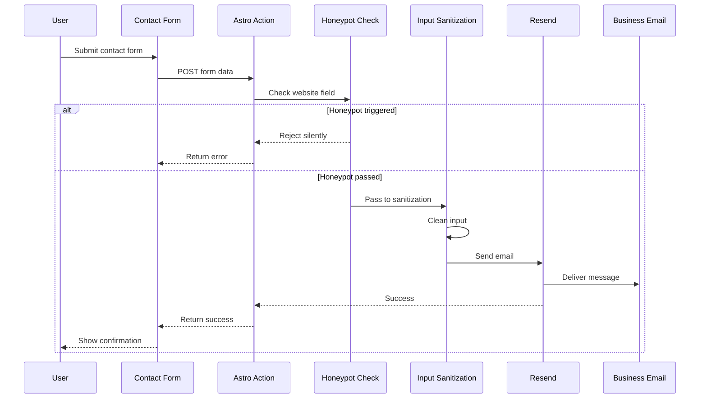

Alefoods uses Resend to handle contact form email delivery. This page covers the technical implementation of the email service integration.

## Why Resend?

Resend was selected for several advantages:

- **Developer-friendly API** - Simple, modern API design
- **Reliable delivery** - High deliverability rates
- **Email verification** - Built-in domain verification
- **TypeScript support** - Official SDK with types
- **Generous free tier** - Suitable for lead generation volume
- **No complex SMTP setup** - Just an API key

## Resend SDK setup

The Resend client is initialized in `src/actions/index.ts`:

```typescript src/actions/index.ts
import { Resend } from 'resend';
import { RESEND_API_KEY, FROM_EMAIL, TO_EMAIL } from 'astro:env/server';

const resend = new Resend(RESEND_API_KEY);
```

### Required environment variables

<ParamField path="RESEND_API_KEY" type="string" required>
  Your Resend API key. Obtain from [resend.com/api-keys](https://resend.com/api-keys).
</ParamField>

<ParamField path="FROM_EMAIL" type="string" required>
  Verified sender email address. Must be verified in Resend (e.g., `noreply@alefoods.com`).
</ParamField>

<ParamField path="TO_EMAIL" type="string" required>
  Destination email for receiving inquiries (e.g., `leads@alefoods.com`).
</ParamField>

All three variables are configured in `astro.config.mjs`:

```javascript astro.config.mjs
env: {
  schema: {
    RESEND_API_KEY: envField.string({
      context: 'server',
      access: 'secret',
      optional: false,
      default: 'INFORM_VALID_TOKEN',
    }),
    FROM_EMAIL: envField.string({
      context: 'server',
      access: 'secret',
      optional: false,
      default: 'INFORM_VALID_EMAIL',
    }),
    TO_EMAIL: envField.string({
      context: 'server',
      access: 'secret',
      optional: false,
      default: 'INFORM_VALID_EMAIL',
    }),
  }
}
```

## Email sending flow

The complete flow from form submission to email delivery:



## Astro Action implementation

The contact form uses an Astro Action for server-side email sending:

```typescript src/actions/index.ts
export const server = {
    send: defineAction({
        accept: 'form',
        input: z.object({
            name: z.string().min(2, 'Name too short.').max(50, 'Name too long.'),
            mail: z.string().email('Invalid email.').max(75),
            message: z.string().min(10, 'Min 10 characters.').max(200, 'Max 200 characters.'),
            website: z.string().optional()
        }),
        handler: async ( input ) => {
            // Implementation...
        }
    })
}
```

### Why Astro Actions?

- **Server-side execution** - API keys never exposed to client
- **Built-in validation** - Zod schema validation
- **Type safety** - Full TypeScript support
- **Progressive enhancement** - Works without JavaScript

## Honeypot spam protection

The action includes a honeypot field to block bots:

```typescript src/actions/index.ts (lines 24-28)
if (website && website.trim() !== '') {
    console.log('🪤 Honeypot activado → mail NO enviado');
    return { success: false, message: 'Honeypot activado' };
}
```

### How the honeypot works

<Steps>
  <Step title="Hidden field">
    The `website` field is hidden from users via CSS (`display: none;`)
  </Step>
  <Step title="Bot auto-fill">
    Bots often fill all form fields automatically, including hidden ones
  </Step>
  <Step title="Detection">
    If the field has any value, it's a bot submission
  </Step>
  <Step title="Silent rejection">
    The submission is rejected without sending email, but no error is shown to avoid informing bots
  </Step>
</Steps>

<Tip>
Honeypots are more user-friendly than CAPTCHAs and effectively block most automated spam.
</Tip>

## Input sanitization

All user input is sanitized before sending:

```typescript src/actions/index.ts (lines 31-38)
function sanitizeText ( text: string ): string {
    return text.trim()
        .replace(/[<>]/g, '')           // Remove angle brackets
        .replace(/['\"]]/g, '')        // Remove quotes
        .replace(/javascript:/gi, '')   // Remove javascript: protocol
        .replace(/on\w+=/gi, '')        // Remove event handlers (onclick, etc.)
        .slice(0, 200);                 // Enforce max length
}

const cleanedName = sanitizeText(name);
const cleanedMail = sanitizeText(mail);
const cleanedMessage = sanitizeText(message);
```

### What gets removed

| Input | Sanitized Output |
|-------|------------------|
| `<script>alert('xss')</script>` | `scriptalert('xss')/script` |
| `John "The Boss" Doe` | `John The Boss Doe` |
| `javascript:alert(1)` | `alert(1)` |
| `` | `img src=x alert(1)` |

This prevents XSS attacks if the email content is displayed in a web interface.

## Sending the email

After sanitization, the email is sent via Resend:

```typescript src/actions/index.ts (lines 45-50)
await resend.emails.send({
    from: FROM_EMAIL,
    to: TO_EMAIL,
    subject: `${cleanedName} desea negociar.`,
    html: `<strong>Mail: </strong>${cleanedMail} <br/> <strong>Mensaje: </strong> <br/> ${cleanedMessage}`,
});
```

### Email parameters

<ParamField path="from" type="string" required>
  Sender email address. Must be verified in Resend.
</ParamField>

<ParamField path="to" type="string" required>
  Recipient email address (your business email).
</ParamField>

<ParamField path="subject" type="string" required>
  Email subject line. Includes the contact's name for easy identification.
</ParamField>

<ParamField path="html" type="string">
  HTML email body. Contains the contact's email and message.
</ParamField>

### Email template

The email looks like this:

```html
<strong>Mail: </strong>john@example.com <br/>
<strong>Mensaje: </strong> <br/>
I'm interested in ordering 500kg of organic quinoa for our restaurant chain.
```

<Info>
The email uses basic HTML formatting. You could create richer email templates using Resend's React Email support.
</Info>

## Error handling

The action includes try-catch error handling:

```typescript src/actions/index.ts (lines 53-56)
catch ( err ) {
    console.log('❌ Error al enviar mail:', err);
    return { success: false, message: 'An error occurred while sending the message.'}
}
```

### Common error scenarios

<AccordionGroup>
  <Accordion title="Invalid API key">
    **Error:** `Error: Invalid API key`
    
    **Cause:** `RESEND_API_KEY` is incorrect or expired
    
    **Fix:** Get a new API key from Resend dashboard
  </Accordion>
  
  <Accordion title="Unverified sender">
    **Error:** `Error: Sender email not verified`
    
    **Cause:** `FROM_EMAIL` domain not verified in Resend
    
    **Fix:** Complete domain verification in Resend settings
  </Accordion>
  
  <Accordion title="Rate limiting">
    **Error:** `Error: Rate limit exceeded`
    
    **Cause:** Too many emails sent in a short period
    
    **Fix:** Wait before sending more emails, or upgrade Resend plan
  </Accordion>
  
  <Accordion title="Network issues">
    **Error:** `Error: ECONNREFUSED`
    
    **Cause:** Cannot reach Resend API
    
    **Fix:** Check internet connectivity and Resend status page
  </Accordion>
</AccordionGroup>

## Response format

The action returns a consistent response:

**Success:**
```json
{
  "success": true,
  "message": "Message sent successfully."
}
```

**Failure:**
```json
{
  "success": false,
  "message": "An error occurred while sending the message."
}
```

## Domain verification

For production use, verify your domain in Resend:

<Steps>
  <Step title="Add domain">
    Go to Resend dashboard → Domains → Add Domain. Enter your domain (e.g., `alefoods.com`).
  </Step>
  <Step title="Configure DNS records">
    Add the provided DNS records to your domain registrar:
    - SPF record (TXT)
    - DKIM record (TXT)
    - DMARC record (TXT)
  </Step>
  <Step title="Verify">
    Wait for DNS propagation (up to 48 hours), then click "Verify" in Resend.
  </Step>
  <Step title="Update FROM_EMAIL">
    Change `FROM_EMAIL` to use your verified domain (e.g., `noreply@alefoods.com`).
  </Step>
</Steps>

<Warning>
Without domain verification, emails may land in spam folders or be rejected entirely.
</Warning>

## Email deliverability best practices

<AccordionGroup>
  <Accordion title="Use a dedicated sending domain">
    Don't use your main domain for transactional emails. Use a subdomain like `mail.alefoods.com`.
  </Accordion>
  
  <Accordion title="Configure SPF, DKIM, and DMARC">
    These DNS records authenticate your emails and improve deliverability.
  </Accordion>
  
  <Accordion title="Monitor bounce rates">
    Check Resend analytics for bounced emails. High bounce rates hurt your sender reputation.
  </Accordion>
  
  <Accordion title="Avoid spam trigger words">
    Words like "free", "guarantee", "click here" can trigger spam filters (though less relevant for contact forms).
  </Accordion>
  
  <Accordion title="Set up a reply-to address">
    Configure a reply-to address so recipients can respond easily.
  </Accordion>
</AccordionGroup>

## Rate limiting

Resend enforces rate limits:

| Plan | Limit |
|------|-------|
| Free | 100 emails/day, 3,000 emails/month |
| Pro | 50,000 emails/month |
| Enterprise | Custom |

For a lead generation form, the free tier is usually sufficient.

<Tip>
If you need application-level rate limiting (e.g., max 5 submissions per IP per hour), implement it in the Astro Action handler.
</Tip>

## Testing email sending

### Local testing

Use Resend's test mode or a test email address:

```bash .env
RESEND_API_KEY=re_test_key
FROM_EMAIL=onboarding@resend.dev
TO_EMAIL=your-email@gmail.com
```

Resend provides `onboarding@resend.dev` for testing without domain verification.

### Production testing

After deploying:

<Steps>
  <Step title="Submit test form">
    Go to your production site's `/contact-us` page and submit a test inquiry.
  </Step>
  <Step title="Check email inbox">
    Verify the email arrives at `TO_EMAIL`.
  </Step>
  <Step title="Check Resend logs">
    View the email in Resend dashboard → Emails to confirm delivery.
  </Step>
</Steps>

## Monitoring and analytics

Resend provides email analytics:

- **Sent** - Total emails sent
- **Delivered** - Successfully delivered emails
- **Bounced** - Failed deliveries (hard/soft bounces)
- **Opened** - Email opens (if tracking enabled)
- **Clicked** - Link clicks (if tracking enabled)

Access analytics in the Resend dashboard.

## Next steps

<CardGroup cols={2}>
  <Card title="Contact Form Feature" icon="envelope" href="/features/contact-form">
    Learn about the contact form implementation
  </Card>
  <Card title="Contact Action API" icon="code" href="/api/contact-action">
    API reference for the send action
  </Card>
  <Card title="Environment Variables" icon="key" href="/development/environment-variables">
    Configure Resend environment variables
  </Card>
</CardGroup>