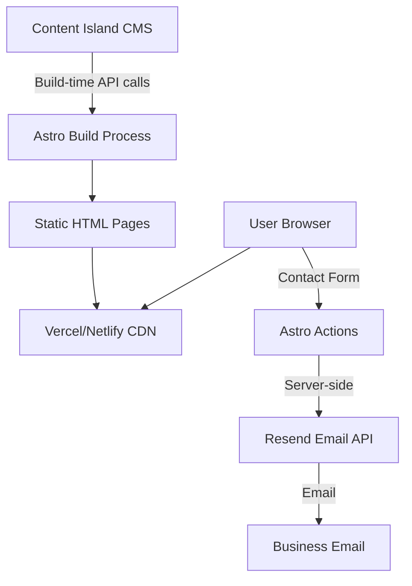
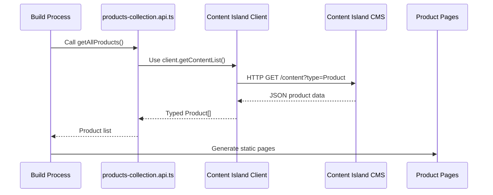
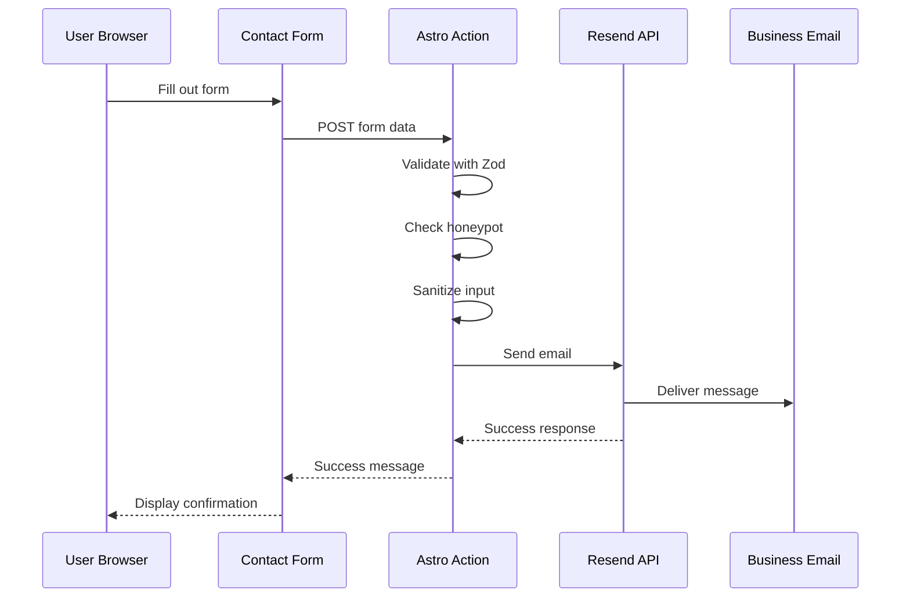

Alefoods is built as a statically generated site using modern web technologies. This architecture provides optimal performance, SEO benefits, and low hosting costs.

## Architecture diagram



## Technology stack

Alefoods uses a carefully selected modern stack:

### Frontend framework

**Astro 5.15.4** - Static site generator
- File-based routing
- Component islands architecture
- Server-side rendering for actions
- Excellent performance out of the box

```json package.json
{
  "dependencies": {
    "astro": "^5.15.4"
  }
}
```

### Styling

**Tailwind CSS 4.1.17** - Utility-first CSS framework
- Integrated via Vite plugin
- Responsive design utilities
- Custom design system

```javascript astro.config.mjs
import tailwindcss from '@tailwindcss/vite';

export default defineConfig({
  vite: {
    plugins: [tailwindcss()]
  }
});
```

### Content management

**Content Island** - Headless CMS
- API-first content delivery
- Structured content for products and recipes
- Build-time content fetching

### Email service

**Resend** - Transactional email API
- Reliable email delivery
- Simple API integration
- Used for contact form submissions

### Deployment

**Vercel** (primary) / **Netlify** (alternative)
- Automatic deployments from Git
- CDN distribution
- Edge network for global performance

## Build process

Alefoods uses static site generation:

<Steps>
  <Step title="Content fetching">
    Astro fetches products and recipes from Content Island API using `CONTENT_ISLAND_SECRET_TOKEN`
  </Step>
  <Step title="Page generation">
    Static HTML pages are generated for:
    - Homepage (`/`)
    - Product listing (`/products`)
    - Individual products (`/products/[slug]`)
    - Recipe listing (`/recipes`)
    - Individual recipes (`/recipes/[slug]`)
    - Contact page (`/contact-us`)
    - About page (`/about-us`)
  </Step>
  <Step title="Asset optimization">
    Images, CSS, and JavaScript are optimized and bundled
  </Step>
  <Step title="Deployment">
    Static files are deployed to Vercel/Netlify CDN
  </Step>
</Steps>

## Static vs. dynamic content

Alefoods uses a hybrid approach:

### Static content (build-time)

- Product catalog pages
- Recipe pages
- About page
- Homepage

**Advantages:**
- Instant page loads (pre-rendered HTML)
- Excellent SEO
- Low server costs
- High reliability

### Dynamic content (server-side)

- Contact form submission (Astro Actions)
- Email sending via Resend

**Why server-side for forms:**
- Secure API key handling
- Input validation and sanitization
- Spam protection (honeypot)
- No client-side exposure of email credentials

## Component organization

Alefoods uses a "pods" pattern for organizing data-driven features:

```
src/
├── actions/              # Server-side actions
│   └── index.ts          # Contact form action
├── components/          # Reusable UI components
│   ├── Hero.astro
│   ├── Navbar.astro
│   └── Footer.astro
├── layouts/             # Page layouts
│   └── Layout.astro      # Base layout with navbar/footer
├── pages/               # File-based routing
│   ├── index.astro       # Homepage
│   ├── products/
│   ├── recipes/
│   └── contact-us.astro
├── pods/                # Data + presentation pods
│   ├── products-collection/
│   │   ├── products-collection.model.ts
│   │   ├── products-collection.api.ts
│   │   └── products-collection.pod.astro
│   └── recipe-collection/
│       ├── recipe-collection.model.ts
│       ├── recipe-collection.api.ts
│       └── recipe-collection.pod.astro
└── lib/                 # Utilities and clients
    └── client.ts         # Content Island client
```

## Pods pattern

Each pod combines three files:

1. **Model** (`.model.ts`) - TypeScript interfaces
2. **API** (`.api.ts`) - Data fetching functions
3. **Component** (`.pod.astro`) - Presentation component

This pattern provides:
- **Separation of concerns** - Data, types, and UI are separate
- **Type safety** - Models define data structure
- **Reusability** - Pods can be used across multiple pages
- **Testability** - Each layer can be tested independently

## Routing

Astro's file-based routing maps files to URLs:

| File | URL |
|------|-----|
| `pages/index.astro` | `/` |
| `pages/about-us.astro` | `/about-us` |
| `pages/contact-us.astro` | `/contact-us` |
| `pages/products/index.astro` | `/products` |
| `pages/products/[slug].astro` | `/products/*` |
| `pages/recipes/index.astro` | `/recipes` |
| `pages/recipes/[slug].astro` | `/recipes/*` |

**Dynamic routes** use `[slug]` syntax to generate pages from CMS content.

## Data flow

### Product catalog data flow



### Contact form data flow



## Performance characteristics

### Page load performance

- **First Contentful Paint (FCP)**: < 1s (static HTML)
- **Largest Contentful Paint (LCP)**: < 2.5s
- **Time to Interactive (TTI)**: < 3s
- **Cumulative Layout Shift (CLS)**: < 0.1

### Build performance

- **Build time**: 30-60 seconds (depends on content volume)
- **Content API calls**: 2 (products + recipes)
- **Pages generated**: ~50-100 (varies with content)

## Security architecture

<AccordionGroup>
  <Accordion title="API key protection">
    - `CONTENT_ISLAND_SECRET_TOKEN` only used server-side during build
    - `RESEND_API_KEY` never exposed to client
    - Environment variables configured in hosting platform
  </Accordion>
  
  <Accordion title="Input sanitization">
    - All contact form input sanitized before email sending
    - XSS prevention via text cleaning
    - Zod schema validation on all inputs
  </Accordion>
  
  <Accordion title="Spam protection">
    - Honeypot field in contact form
    - Server-side validation (not bypassable)
    - Rate limiting via Resend API limits
  </Accordion>
  
  <Accordion title="Content Security Policy">
    - Static site eliminates many attack vectors
    - No user-generated content
    - No SQL injection risk (no database)
  </Accordion>
</AccordionGroup>

## Deployment architecture

Alefoods is configured for Vercel deployment:

```javascript astro.config.mjs
import vercel from '@astrojs/vercel';

export default defineConfig({
  site: "https://alefoods.vercel.app",
  output: 'static', 
  adapter: vercel(),
});
```

**Deployment flow:**

<Steps>
  <Step title="Code push">
    Developer pushes code to GitHub
  </Step>
  <Step title="Vercel webhook">
    Vercel detects changes and starts build
  </Step>
  <Step title="Build execution">
    Vercel runs `pnpm build` with environment variables
  </Step>
  <Step title="Static file upload">
    Built files uploaded to Vercel's CDN
  </Step>
  <Step title="Global distribution">
    Content served from edge locations worldwide
  </Step>
</Steps>

## Next steps

<CardGroup cols={2}>
  <Card title="Content Island Integration" icon="plug" href="/architecture/content-island-integration">
    Deep dive into CMS integration
  </Card>
  <Card title="Email Service" icon="envelope" href="/architecture/email-service">
    Learn about Resend email integration
  </Card>
  <Card title="Project Structure" icon="folder" href="/development/project-structure">
    Explore the codebase organization
  </Card>
  <Card title="Deployment" icon="rocket" href="/development/deployment">
    Deployment guide for Vercel and Netlify
  </Card>
</CardGroup>